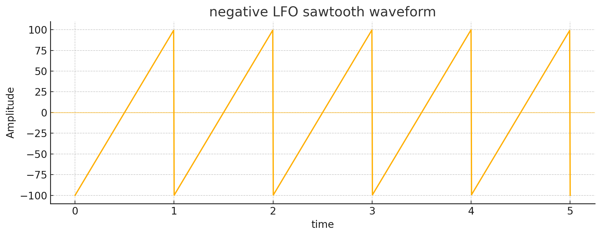
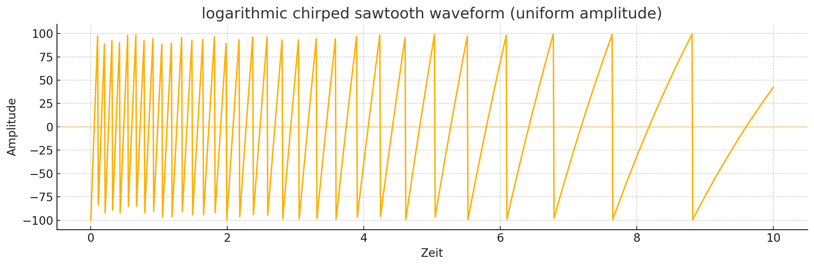

# DUB-IY short manual 
27.06.2025

<a href="../ger">ger</a>

The Dub Siren DUB-IY is an electronic sound generator that can be used in Dub and Reggae music. It produces modulated, siren-like sounds or effects that can be layered rhythmically or improvised over a track.

## Overview

**Fire Button 1-4 (F1 - F4):** 

Fire a sound. Fire Buttons 1-4 play the saved or edited sounds. Releasing the buttons stops the sound unless one of the adjacent buttons is pressed.

**Fire button 1-4 + Fire Button next to it**:

Hold sound until Fire Button is pressed again.

**Shift (S3) + Fire Button 1-4:**

Select memory bank: Fire Buttons 1-4 load the sounds of the selected bank from memory. A bank consists of 4 buttons. This allows up to 16 sounds to be stored:

- Bank1: 1 to 4
- Bank2: 5 to 8
- Bank3: 9 to 12
- Bank4: 13 to 16

**Save (S4) + Fire Button 1-4:** 

Save sound: any newly edited sound can be easily saved to a Fire Button using this key combination.
Any previously saved sound in the same location will be overwritten.

**Basic state**

If no key is pressed, the last used Fire Button will flash briefly. This shows which sound is currently selected and being edited. This is very helpful before saving to avoid accidentally overwriting a sound.

## Sound Edit 

The sound parameters can be influenced by the following potentiometers (knobs):

**Tune (P1):** Pitch of tone

**Speed (P2):** Speed of the selected LFO

**Mod (P3):** Modulation strength of the selected LFO

_Example of the positive and negative modulation strength of the LFO on a sawtooth wave_

## Sound Edit "Shift Mode" (Shift LED on -> S3)

**Shift Button (S3)**: Switching from normal Sound Edit mode to Sound Edit "Shift Mode."

In "Shift Mode," the potentiometers (knobs) P1, P2, and P3 acquire new functions:

**Tune (P1):** affects the duty cycle (pulse width) of the tone. By default, the pulse width of the tone is 50%, which can be made "thinner."

_Square wave of the tone with pulse width 50% to 10%_

**Speed (P2):** Influences the speed of the LFO with an envelope generator.
This allows the LFO's speed to be changed dynamically.

**Mod (P3):** Influences the modulation strength of the envelope generator:
- Negative value: slow -> fast
- Positive value: fast -> slow

_Example of influencing a sawtooth LFO by the timing envelope generator_.

> [!TIP]
> The timing generator (P2) influences the speed of the active LFO (see [Functionbuttons](#functionbuttons)).

## Function Buttons

The DUB-YI features two LFOs (low-frequency oscillators) that generate the waveforms used to modulate the sound.

**Wave Button (S1):** 

Selecting the waveform for the selected LFO:

For each LFO, 3 waveforms are selectable
- Rectangle 
- Triangle 
- Sawtooth 
  
The strength and type of the waveform are influenced positively or negatively by the modulation strength (P3), depending on the selected value. At the center position of P3 (0), the respective LFO no longer has any influence.
 
The P3 control has a special feature for LFO1 with the selected waveform "square":
- Positive value: 2 pitches 
- Negative value Wert: 3 pitches 
- Minimal value: interrupted sound 

**LFO Button (S2):** 

Select LFO1 or LFO2.

Each LFO has an independent, storable set of parameters that can be adjusted via P1, P2, and P3.

Both LFOs influence (modulate) each other.

## Examples of Modulation

_Modulating a triangle wave from LFO1 with a faster triangle wave from LFO2 at 5%. This creates a slight "vibrato effect"_.

_Modulation of a triangle wave from LFO1 with the triangle wave from LFO2, but with +50% modulation strength_.

## Special Functions / Flags

> [!CAUTION]
> Experimental functions

**LFO Button (S2) pressed + Fire Button 1-4:** 

Various special functions can be switched on using 4 flags.

**Fire1 = Flag1**: LFO2 always starts when a new sound is fired.

**Fire2 = Flag2**: One Shot: after LFO1 has played a full period, the sound stops.

**Fire3 = Flag3**: Modulation multiplier x 2

**Fire4 = Flag4**: Unused

Flag 1 is set by default for new sounds so that LFO1 and LFO2 always start together when the Fire Buttons are pressed. If Flag 1 is turned off, LFO2 continues to run and starts randomly somewhere after the Fire Button is pressed.

## Panic Function (Reset LFO2 and Timing Envelope)

If the sound has become too complex and you just want to hear the basic sound again, you can simply turn off LFO2 and the Timing Envelope by pressing buttons S3 and S4 simultaneously.

## Echo / Delay Effect / Master Volume

**Delay (E1)**: Delay time of the echo, from short to long

**Feedback (E2)**: Strength with which the echo is mixed with the output signal and strength of the feedback of the input signal. At maximum value, the feedback is infinitely long.

**Vol (E3)**: Master Output Volume

> [!Important]
> Echo and master volume (parameters E1 to E3) cannot be saved!

---

> [!Note]
> We reserve the right to improve or adapt the functionality as needed.

