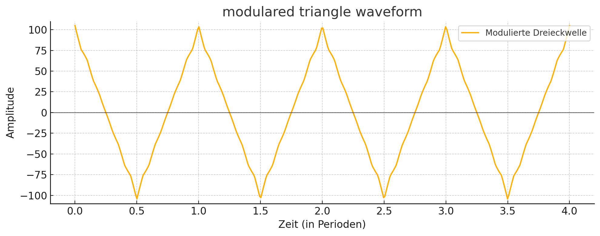

# DUB-IY short manual 
27.06.2025

<a href="../ger">ger</a>

The Dub Siren DUB-IY is an electronic sound generator that can be used in dub and reggae music. It produces modulated, siren-like sounds or effects that can be layered rhythmically or improvised over a track.

## Overview

**Firebutton 1-4 (F1 - F4):** 

Fire a sound. Fire buttons 1-4 play the saved or edited sounds. Releasing the buttons stops the sound unless one of the adjacent buttons is pressed.

**Firebutton 1-4 + Firebutton next to it**:

Hold sound until fire button is pressed again.

**Shift (S3) + Firebutton 1-4:**

Select memory bank: Fire buttons 1-4 load the sounds of the selected bank from memory. A bank consists of 4 buttons. This allows up to 16 sounds to be stored:

- Bank1: 1 to 4
- Bank2: 5 to 8
- Bank3: 9 to 12
- Bank4: 13 to 16

**Save (S4) + Firebutton 1-4:** 

Save sound: Any newly edited sound can be easily saved to a Fire button using this key combination.
Any previously saved sound in the same location will be overwritten.

**basic state**

If no key is pressed, the last used fire button will flash briefly. This shows which sound is currently selected and being edited. This is very helpful before saving to avoid accidentally overwriting a sound.

## Sound Edit 

The sound parameters can be influenced by the following potentiometers (knobs):

**Tune (P1):** pitch of tone

**Speed (P2):** Speed of the selected LFO

**Mod (P3):** Modulation strength of the selected LFO

_Example of the positive and negative modulation strength of the LFO on a sawtooth wave_

## Sound Edit "Shift Mode" (Shift LED on -> S3)

**Shift-Button (S3)**: Switching from normal Sound Edit mode to Sound Edit "Shift Mode."

In "Shift Mode," the potentiometers (knobs) P1, P2, and P3 acquire new functions:

**Tune (P1):** affects the duty cycle (pulse width) of the tone. By default, the pulse width of the tone is 50%, which can be made "thinner."

_Square wave of the tone with pulse width 50% to 10%_

**Speed (P2):** Influences the speed of the LFO with an envelope generator.
This allows the LFO's speed to be changed dynamically.

**Mod (P3):** Influences the modulation strength of the envelope generator
Negative value: slow -> fast
Positive value: fast -> slow

_Example of influencing a sawtooth LFO by the timing envelope generator_.

> [!TIP]
> The timing generator (P2) influences the speed of the active LFO (see [Functionbuttons](#functionbuttons)).

## functionbuttons

The DUB-YI features two LFOs (low-frequency oscillators) that generate the waveforms used to modulate the sound.

**Wave-Button (S1):** 

Selecting the waveform for the selected LFO:

For each LFO, 3 waveforms are selectable
- Rectangle 
- Triangle 
- Sawtooth 
  
The strength and type of the waveform are influenced positively or negatively by the modulation strength (P3), depending on the selected value. At the center position of P3 (0), the respective LFO no longer has any influence.
 
The P3 control has a special feature for LFO1 with the selected waveform "square":
- Positive value: 2 pitches 
- Negative value Wert: 3 pitches 
- Minimal value: interrupted sound 

**LFO-Button (S2):** 

Select LFO1 or LFO2.

Each LFO has an independent, storable set of parameters that can be adjusted via P1, P2, and P3.

Both LFOs influence (modulate) each other.

## Examples of modulation

_Modulating a triangle wave from LFO1 with a faster triangle wave from LFO2 at 5%. This creates a slight "vibrato effect"_.

_Modulation of a triangle wave from LFO1 with the triangle wave from LFO2, but with +50% modulation strength_.

## Special functions / Flags

> [!CAUTION]
> Experimentelle Funktion

**LFO-Button (S2) pressed + Firebutton 1-4:** 

Various special functions can be switched on using 4 flags.

**Fire1 = Flag1**: LFO2 startet immer bei neu beim abfeuern von Sounds.

**Fire2 = Flag2**: One Shot: Nach dem LFO1 eine vollständite Periode gespielt hat, wird der Sound gestoppt

**Fire3 = Flag3**: Multiplikator der Modulation x 2

**Fire4 = Flag4**: Unbenutzt

Flag 1 ist standardmäßig bei neuen Sounds gesetzt, damit LFO1 und LFO2 beim Drücken der Firebuttons immer zusammen gestartet werden. Wenn Flag 1 ausgeschaltet wird, läuft der LFO2 weiter und startet nach dem drücken des Firebutton irgendwo zufällig.

## Panik-Funktion (Reset LFO2 und Timing-Envelope)

Sollte der Sound zu komplex geworden sein, und man möchte nur wieder den Grundsound hören, kann man den LFO2 und den Timing-Envelope einfach ausschalten, indem man die Taster S3 + S4 gleichzeitig drückt.

## Echo / Delayeffekt / Mastervolume

**Delay (E1)**: Verzögerungszeit des Echo, von kurz nach lang

**Feedback (E2)**: Stärke, mit der das Echo dem Ausgangssignal zugemischt wird und Stärke der Rückkopplung (Feedback) des Eingangssignals. Bei maximalem Wert ist das Feedback unendlich lang.

**Vol (E3)**: Ausgangslautstärke Master

> [!Important]
> Echo und Mastervolume (Parameter E1 bis E3) sind nicht abspeicherbar! 

---

> [!Note]
> Wir behalten uns vor, die Funktionalität bei Bedarf zu verbessern oder anzupassen. 

