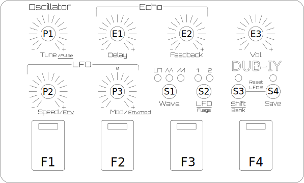
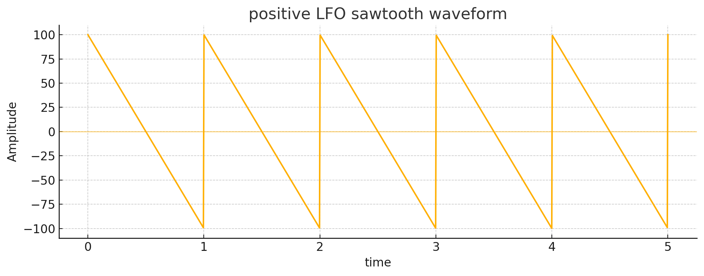
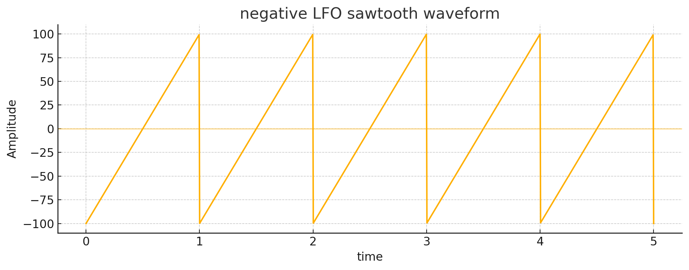
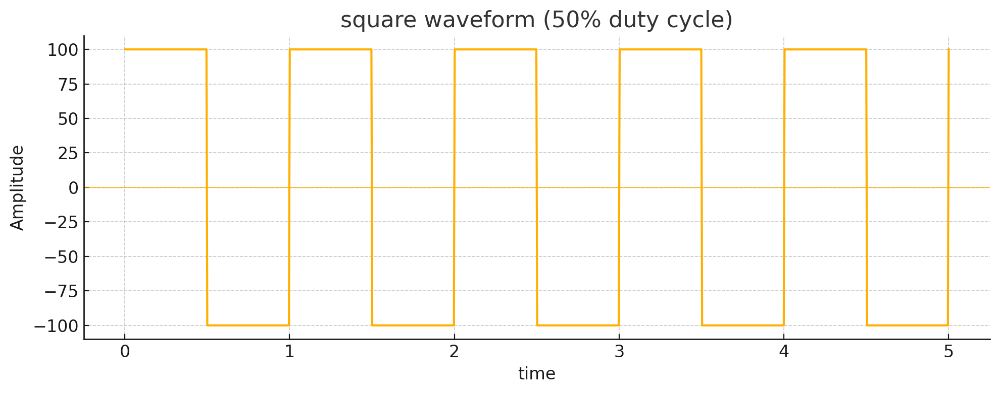
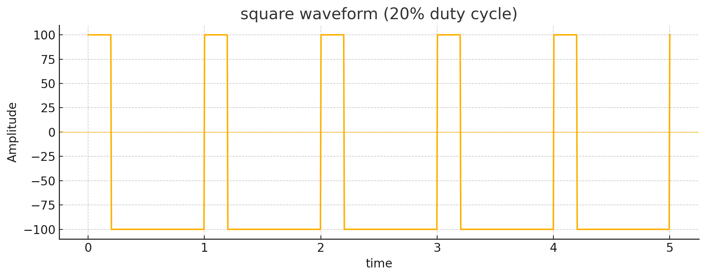
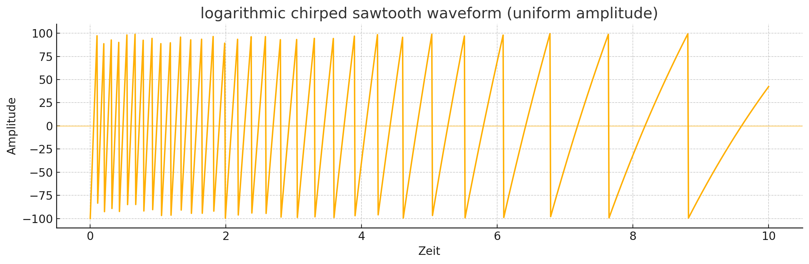
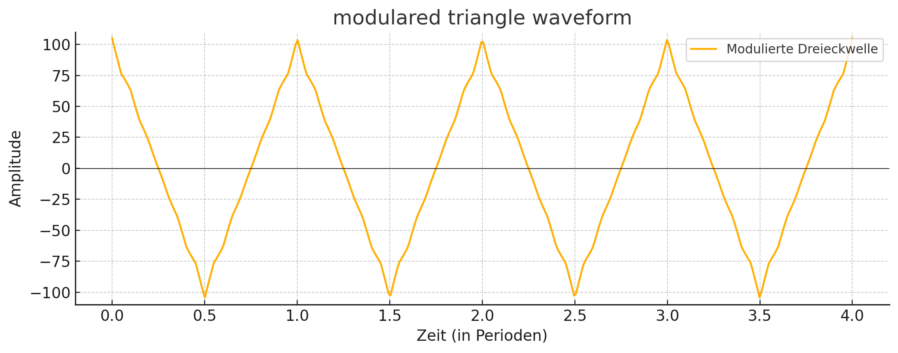
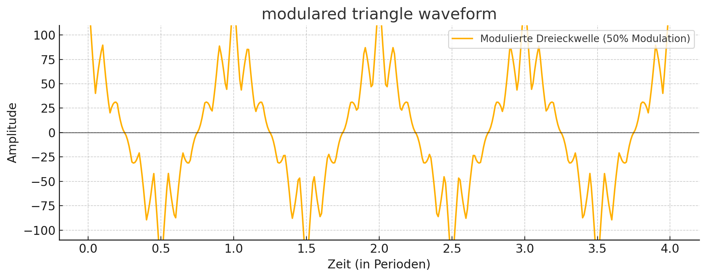

# DUB-IY Kurzanleitung 
27.06.2025

## Global

**Firebutton 1-4 (F1 - F4):** 

Sound abfeuern. Mit den Firebuttons 1-4 werden die abgespeicherten oder editierten Sounds abgespielt. Beim Loslassen der Buttons stoppt der Sound, es sei denn, eine der Nachbartasten wurde gedrückt.

**Firebutton 1-4 + benachbarter Firebutton**:

Sound halten bis Firebutton erneut gedrückt wurde.

**Shift (S3) + Firebutton 1-4:**

Speicherbank wählen: Mit den Firebuttons 1-4 werden die Sounds der gewählten Bank aus dem Speicher geladen. Eine Bank besteht aus jeweils vier Buttons. Damit können bis zu 16 Sounds gespeichert werden:

- Bank1: 1 bis 4
- Bank2: 5 bis 8
- Bank3: 9 bis 12
- Bank4: 13 bis 16

**Save (S4) + Firebutton 1-4:** 

Sound abspeichern: Jeder neue editierte Sound kann einfach auf einen Firebutton mit dieser Tastenkombination gespeichert werden. 
Ein eventuell zuvor gespeicherter Sound auf dem selben Speicherplatz wird dabei überschrieben.

**Grundzustand**

Wenn keine Taste gedrückt wurde, blinkt der zuletzt benutzte Firebutton immer wieder kurz. Dadurch ist ersichtlich, welcher Sound gerade gewählt und editiert wird. Dies ist sehr hilfreich vor dem Speichern, um nicht versehentlich einen Sound zu überschreiben.

## Sound Edit 

Die Parameter der Sounds können durch folgende Potentiometer (Drehregler)
beeinflusst werden:

**Tune (P1):** Tonhöhe

**Speed (P2):** Geschwindigkeit des gewählten LFO

**Mod (P3):** Modulationsstärke des gewählten LFO

_Beispiel der positiven und negativen Modulationsstärke des LFO bei einer Sägezahnwelle_

## Sound Edit "Shift Mode" (Shift LED an -> S3)

**Shift-Button (S3)**: Umschalten vom normalen Sound-Edit mode in den Sound Edit "Shift Mode".

Im "Shift Mode" bekommen die Potentiometer (Drehregler) P1, P2, P3 neue Funktionen:

**Tune (P1):** beeinflusst das Duty Cycle (Pulsbreite) des Tons. Dadurch kann der Ton "dünner" gemacht werden.

_Rechtecksignal des Tons mit Duty Cycle 50% (Standard)_

_Rechteck mit Duty Cycle 20% nach dem Verändern des P1_

**Speed (P2):** beeinflusst die Geschwindigkeit des LFO mit einem Envelop-Generator (Hüllkurven-Generator)
Dadurch kann der LFO dynamisch in seiner Geschwindigkeit geändert werden 

**Mod (P3):** beeinflusst die Modulationsstärke des Envelop-Generator 
negativ: langsam -> schnell 
positic schnell -> langsam

_Beispiel einer Beeinflussung eines Sägezahhn-LFO durch den Timing-Envelope-Generator_.

> [!TIP]
> Der Timing-Generator (P2) beeinflusst die Geschwindigkeit des aktiven LFO (siehe [Funktionsbuttons](#funktionsbuttons)).

## Funktionsbuttons

Das DUB-YI verfügt über zwei LFO (Low-Frequency Oscillator), welche
die Wellenformen erzeugen, mit dem der Ton moduliert wird.

**Wave-Button (S1):** 

Selektieren der Wellenform für den gewählten LFO:

Bei jedem LFO sind grundsätzlich 3 Wellenformen selektierbar
- Rechteck 
- Dreieck
- Sägezahn 
  
Die Stärke und zum Teil die Art der Wellenform wird durch die Modulationsstärke (P3) positiv / negativ in Abhängigkeit des gewählten Wertes beeinflusst. Bei der Mittelstellung von P3 (0) hat der jeweilige LFO keinen Einfluss mehr.
 
Der Regler P3 hat beim LFO1 mit gewählter Wellenform "Rechteck" eine Besonderheit, da die Wellenform "Rechteck" mit positver wie negativer Modulation gleich klingen würde:
- positiver Wert: 2 Töne
- negativer Wert: 3 Töne 
- Minimaler Wert: Unterbrochener Ton

**LFO-Button (S2):** 

Selektieren von LFO1 oder LFO2.

Jeder LFO hat einen unabhängigen, abspeicherbaren Parametersatz, der über P1, P2, P3 eingestellt werden kann. 
Beide LFO beeinflussen (modulieren) sich gegenseitig.

## Beispiele der Modulation

_Modulation einer Dreieckwelle von LFO1 mit einer schnelleren Dreieckwelle LFO2 mit 5%_. _Es entsteht ein leichter "Vibrato-Effekt"_.

_Modulation einer Dreieckwelle von LFO1 mit der Dreieckwelle LFO2, aber mit +50% Modulationsstärke_.

_Modulation einer Sägezahnwelle von LFO1 mit einer Dreieckwelle doppelter Frequenz von LFO2 mit +50% Modulationsstärke_.

## Spezialfunktionen / Flags

> [!CAUTION]
> Experimentelle Funktion

**LFO-Button (S2) gedrückt + Firebutton 1-4:** 

Über 4 Flags verschiedene Sonderfunktionen eingeschaltet werden.

**Fire1 = Flag1**: LFO2 startet immer bei neu beim abfeuern von Sounds.

**Fire2 = Flag2**: One Shot: Nach dem LFO1 eine vollständite Periode gespielt hat, wird der Sound gestoppt

**Fire3 = Flag3**: Multiplikator der Modulation x 2

**Fire4 = Flag4**: Unbenutzt

Flag 1 ist standardmäßig bei neuen Sounds gesetzt, damit LFO1 und LFO2 beim Drücken der Firebuttons immer zusammen gestartet werden. Wenn Flag 1 ausgeschaltet wird, läuft der LFO2 weiter und startet nach dem drücken des Firebutton irgendwo zufällig.

## Panik-Funktion (Reset LFO2 und Timing-Envelope)

Sollte der Sound zu komplex geworden sein, und man möchte nur wieder den Grundsound hören, kann man den LFO2 und den Timing-Envelope einfach ausschalten, indem man die Taster S3 + S4 gleichzeitig drückt.

## Echo / Delayeffekt / Mastervolume

**Delay (E1)**: Verzögerungszeit des Echo, von kurz nach lang

**Feedback (E2)**: Stärke, mit der das Echo dem Ausgangssignal zugemischt wird und Stärke der Rückkopplung (Feedback) des Eingangssignals. Bei maximalem Wert ist das Feedback unendlich lang.

**Vol (E3)**: Ausgangslautstärke Master

> [!Important]
> Echo und Mastervolume (Parameter E1 bis E3) sind nicht abspeicherbar! 

---

> [!Note]
> Wir behalten uns vor, die Funktionalität bei Bedarf zu verbessern oder anzupassen. 

