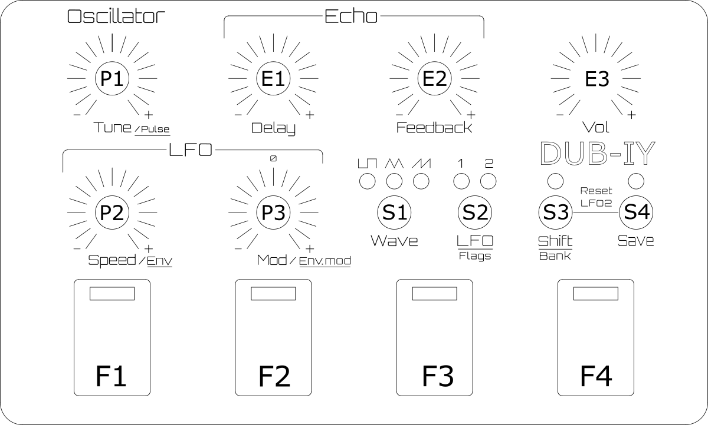

# Short manual
20.06.2025

Global
--

**Firebutton 1-4 (F1 - F4):** Sound abfeuern
Damit werden die abgespeicherten oder editierten Sounds abgespielt. Beim Loslassen des Buttons stoppt der Sound, es sei denn, die Nachbartaste wurde gedrückt.

**Firebutton 1-4 + benachbarten Firebutton**: Sound halten bis Firebutton erneut gedrückt wurde.

**Shift (S3) + Firebutton 1-4:** Speicherbank wählen: Auf den Firebuttons 1-4 werden die Sounds  der gewählten Bank aus dem Speicher geladen:

- Bank1: 1 bis 4
- Bank2: 5 bis 8
- Bank3: 9 bis 12
- Bank4: 13 bis 16

**Save (S4) + Firebutton 1-4:** Sound abspeichern: Wenn ein neuer Sound editiert wurde, kann dieser auf einen Firebutton gespeichert werden. 

Wenn keine Taste gedrückt wurde, blitzt der zuletzt benutzte Firebutton immer wieder kurz. Damit hat man die Übersicht, welcher Sound gerade gewählt und editiert wird. DIes ist sehr hilfreich z.B. vor dem Speichern, um nicht versehentlich einen Sound zu überschreiben.

Sound Edit (Shift LED aus)
--
**Tune (P1):** Tonhöhe

**Speed (P2):** Geschwindigkeit des gewählten LFO

**Mod (P3):** Modulationsstärke des gewählten LFO

**Shift-Button (S3)**: Umschalten vom normalen Sound-Edit mode in den Shift mode, damit bekommen P1,P2,P3 neue Funktionen:

Sound Edit Shift Mode (S3) (Shift LED an)
--
**Tune (P1):** Duty Cycle des Tons

**Speed (P2):** Envelop-Timing-Generator Geschwindigkeit

**Mod (P3):** Envelop-Timing-Generator  Modulationsstärke positiv oder negativ

Hinweis: der Timing-Generator beeinflusst die Geschwindigkeit des aktiven LFO

Funktionsbuttons

**Wave-Button (S1):** selektieren der Wellenform für den gewählten LFO

**LFO-Button (S2):** LFO1 oder LFO2 wählen
Jeder LFO hat einen unabhängigen abspeicherbaren Parametersatz, der über P1,P2,P3 eingestellt werden kann. 

Spezialfunktionen
--
**LFO-Button (S2) gedrückt + Firebutton 1-4:** 
Hier können über 4 Flags verschiedene Sonderfunktionen eingeschaltet werden.
Fire1 = Flag1 : LFO2 startet immer bei neu beim abfeuern von Sounds.

Fire2 = Flag2 : One Shot: Nach dem LFO1 eine vollständite Periode gespielt hat, wird der Sound gestoppt

Fire3 = Flag3 : Multiplikator der Modulation x 2

Fire4 = Flag4 : Unbenutzt

Flag 1 ist standardmäßig bei neuen Sounds gesetzt, damit LFO1 und LFO2 immer beim Drücken der Firebuttons zusammen gestartet werden. Wenn Flag 1 ausgeschaltet wird, läuft der LFO 2 weiter und startet nach dem drücken des Firebutton irgendwo zufällig.

