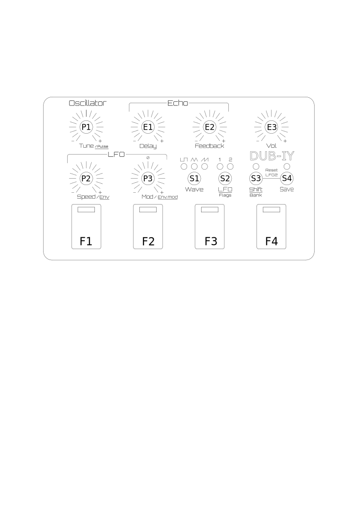
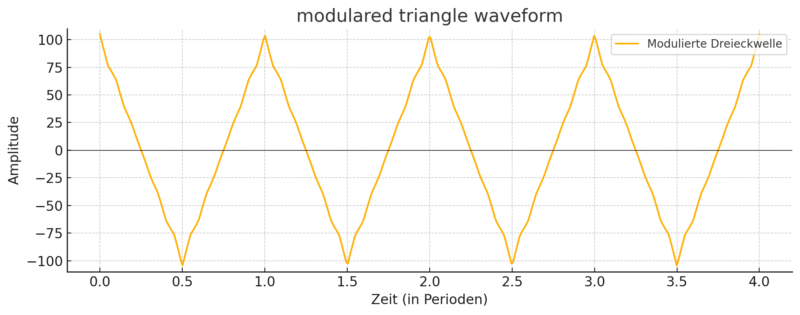
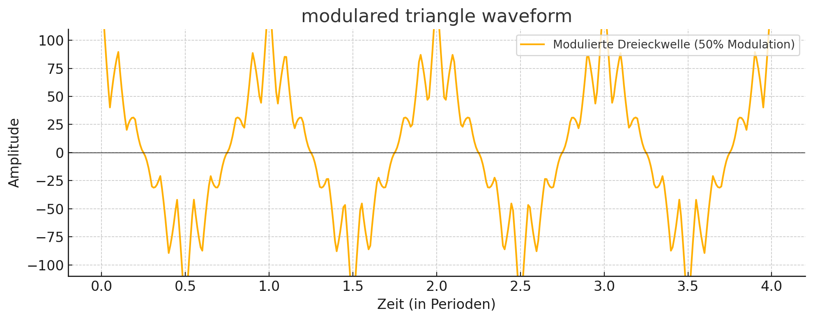
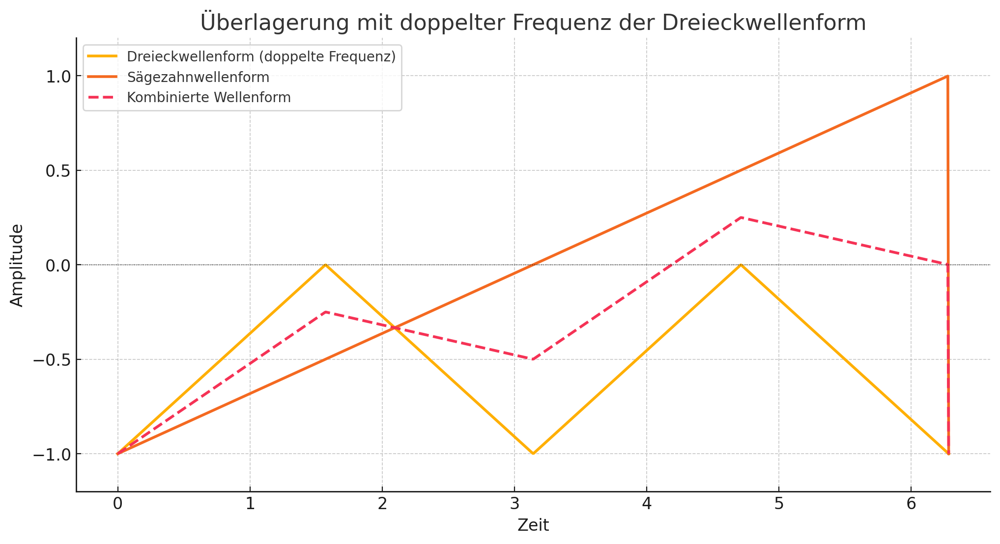

# Short manual
20.06.2025

## Global

**Firebutton 1-4 (F1 - F4):** Sound abfeuern
Damit werden die abgespeicherten oder editierten Sounds abgespielt. Beim Loslassen des Buttons stoppt der Sound, es sei denn, die Nachbartaste wurde gedrückt.

**Firebutton 1-4 + benachbarten Firebutton**: Sound halten bis Firebutton erneut gedrückt wurde.

**Shift (S3) + Firebutton 1-4:** Speicherbank wählen: Auf den Firebuttons 1-4 werden die Sounds  der gewählten Bank aus dem Speicher geladen:

- Bank1: 1 bis 4
- Bank2: 5 bis 8
- Bank3: 9 bis 12
- Bank4: 13 bis 16

**Save (S4) + Firebutton 1-4:** 
Sound abspeichern: Jeder neue editierte Sound kann einfach auf einen Firebutton mit dieser Tastenkombination gespeichert werden. 
Ein eventuell zuvor gespeicherter Sound auf dem selben Speicherplatz wird dabei überschrieben.

**Grundzustand**

Wenn keine Taste gedrückt wurde, blitzt der zuletzt benutzte Firebutton immer wieder kurz. Damit hat man immer die Übersicht, welcher Sound gerade gewählt und editiert wird. Dies ist sehr hilfreich vor dem Speichern, um nicht versehentlich einen Sound zu überschreiben.

## Sound Edit 
Die Sounds können durch folgende Parameter editiert werden:

**Tune (P1):** Tonhöhe

**Speed (P2):** Geschwindigkeit des gewählten LFO

**Mod (P3):** Modulationsstärke des gewählten LFO

**Shift-Button (S3)**: Umschalten vom normalen Sound-Edit mode in den Sound Edit "Shift Mode"

## Sound Edit "Shift Mode" (Shift LED an -> S3)
Im "Shift Mode" bekommen die Potis P1,P2,P3 neue Funktionen:

**Tune (P1):** ist nun das Duty Cycle (Pulsbreite) des Tons

**Speed (P2):** ist die Geschwindigkeit der LFO-Beeinflussung des Envelop-Timing-Generator

**Mod (P3):** ist die Modulationsstärke des Envelop-Timing-Generator (positiv oder negativ)

Hinweis: der Timing-Generator beeinflusst die Geschwindigkeit des aktiven LFO

Funktionsbuttons

**Wave-Button (S1):** selektieren der Wellenform für den gewählten LFO:
Bei jedem LFO sind grundsätzlich 3 Wellenformen selektierbar
- Rechteck 
- Dreieck
- Sägezahn 
  
Die Stärke und zum Teil die Art der Wellenform wird durch die Modulationsstärke (P3) positiv / negativ in Abhängigkeit des gewählten Wertes beeinflusst. Bei der Mittelstellung von P3 (0) hat der jeweilige LFO keinen Einfluss mehr.
 
Der Regler P3 hat beim LFO1 mit gewählter Wellenform "Rechteck" eine Besonderheit, da die Wellenform "Rechteck" mit positver wie negativer Modulation gleich klingen würde:
- positiver Wert: 2 Töne
- negativer Wert: 3 Töne 
- Minimaler Wert: Unterbrochener Ton

**LFO-Button (S2):** 
Selektieren von LFO1 oder LFO2 

Jeder LFO hat einen unabhängigen abspeicherbaren Parametersatz, der über P1,P2,P3 eingestellt werden kann. 
Beide LFO beeinflussen (modulieren) sich gegenseitig.

**Beispiele der Modulation**

Modulation einer Dreieckwelle von LFO1 mit eine schnellere Dreieckwelle LFO2 mit 5%
Hier entsteht ein leichter "Vibrato-Effekt"

Modulation einer Dreieckwelle von LFO1 mit der Dreieckwelle LFO2, aber mit +50% Modulationsstärke

Modulation einer Sägezahnwelle von LFO1 mit einer Dreieckwelle doppelter Frequenz von LFO2 mit +50% Modulationsstärke

## Spezialfunktionen / Flags
ACHTUNG : Experimentelle Funktion

**LFO-Button (S2) gedrückt + Firebutton 1-4:** 
Hier können über 4 Flags verschiedene Sonderfunktionen eingeschaltet werden.
Fire1 = Flag1 : LFO2 startet immer bei neu beim abfeuern von Sounds.

Fire2 = Flag2 : One Shot: Nach dem LFO1 eine vollständite Periode gespielt hat, wird der Sound gestoppt

Fire3 = Flag3 : Multiplikator der Modulation x 2

Fire4 = Flag4 : Unbenutzt

Flag 1 ist standardmäßig bei neuen Sounds gesetzt, damit LFO1 und LFO2 immer beim Drücken der Firebuttons zusammen gestartet werden. Wenn Flag 1 ausgeschaltet wird, läuft der LFO 2 weiter und startet nach dem drücken des Firebutton irgendwo zufällig.

## Panik-Funktion (Reset LFO2 und Timing-Envelope)
Sollte der Sound zu komplex geworden sein, und man möchte nur wieder den Grundsound hören, kann man den LFO2 und den Timing-Envelope einfach ausschalten, indem man die Taster S3 + S4 gleichzeitig drückt.

## Echo / Delayeffekt / Mastervolume

**Delay (E1)**: Verzögerungszeit des Echo, von kurz nach lang

**Feedback (E2)**: Stärke, wie sehr das Echo dem Ausgangssignal zugemischt wird und Rückkopplung (Feedback) des Echosignals. Bei maximalem Wert ist das Feedback unendlich lang.

**Vol (E3)**: Ausgangslautstärke Master

Echo und Mastervolume (Parameter E1 bis E3) sind nicht abspeicherbar! 

Ich behalte mir vor, die Funktionalität bei Bedarf zu verbessern oder anzupassen. 

